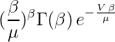

# LatexTools

Wrapper around TexLive to render LaTeX formula into images

## Requirements

### Linux

- Install TexLive from [https://www.tug.org/texlive/](https://www.tug.org/texlive/)

### Mac OS

- Install MacTex from [http://tug.org/mactex/](http://tug.org/mactex/)
- Install dvipng
```$ sudo tlmgr update --self```
```$ sudo tlmgr install dvipng```

## Usage

```php
<?php
  require_once(__DIR__ . 'LatexTools.php');
  $latexTools = new LatexTools();
  $latexTools->renderIntoResponse('(\frac{\beta }{\mu})^\beta {\Gamma(\beta )} \,  e^{-\frac{V\,\beta }{\mu }} \label{gamma}');
```

Will render this nice formula :)



## Functions reference

Render formula and return image in response

```php
$latexTools->renderIntoResponse($formula, $params = []);
```

Render image into file

```php
$fileName = $latexTools->renderIntoFile($formula, $params = []);
```

In above calls `$params` could be any of these values:

- `density` - formula density
- `fallbackToImage` - if need to render regular image for incorrect formula (`true` by default)
- `fallbackImageFontName` - font name for regular image (`fonts/PlayfairDisplay-Regular.ttf` by default)
- `fallbackImageFontSize` - font size for regular image (`16` by default)

Also these paramatares could be set globally. Please see below.

Set formula density (`160` by default)

```php
$latexTools->setDensity($value);
```

By default regular image will be rendered if formula incorrect (`true` by default)

```php
$latexTools->setFallbackToImage(true|false);
```

Example

```php
<?php
  require_once(__DIR__ . 'LatexTools.php');
  $latexTools = new LatexTools();
  $latexTools->renderIntoResponse('not a fromula or broken one x^');
```


Font name for regular image (`fonts/PlayfairDisplay-Regular.ttf` by default)

```php
$latexTools->setFallbackImageFontName($value);
```

Font size for regular image (`16` by default)

```php
$latexTools->setFallbackImageFontName($value);
```

Check if formula correct

```php
$result = $latexTools->isValidLaTeX($formula);
```

Set directory for cache files (`/tmp` by default)

```php
$latexTools->setCacheDir($value);
```

Set directory for temp files (`/tmp` by default)

```php
$latexTools->setTempDir($value);
```
